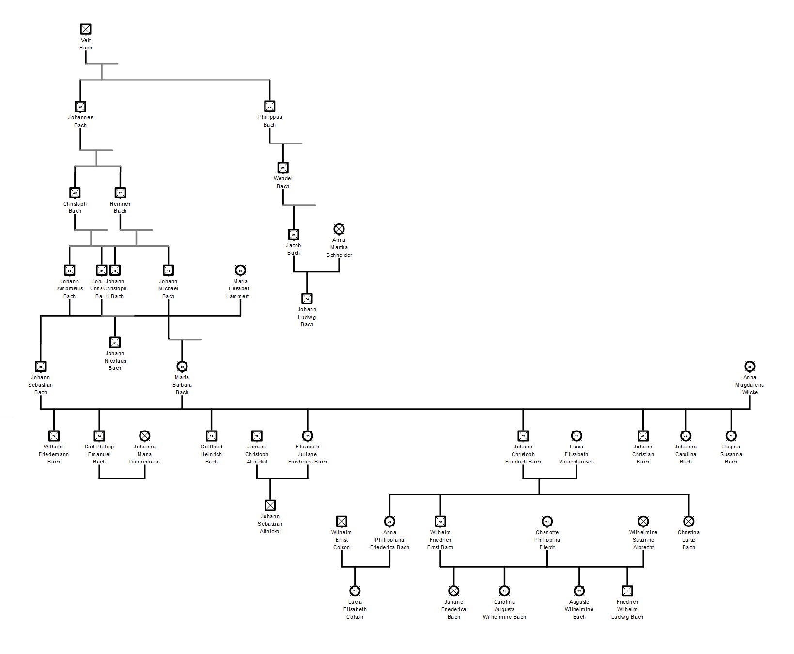

# Отчет по курсовому проекту
## по курсу "Логическое программирование"

### студент: Бирюков В.В.

## Результат проверки

| Преподаватель     | Дата         |  Оценка       |
|-------------------|--------------|---------------|
| Сошников Д.В. |              |               |
| Левинская М.А.|              |               |

> *Комментарии проверяющих (обратите внимание, что более подробные комментарии возможны непосредственно в репозитории по тексту программы)*

## Введение

В ходе выполнения курсового проекта я познакомлюсь с форматом родословных деревьев GEDCOM, использую какой-либо язык для преобразования этого формата в набор фактов Пролога. Научусь находить различные пути в этом дереве, определяя произвольную степень родства и реализую естественно-языковой интерфейс для подобных запросов.

## Задание

 1. Создать родословное дерево на несколько поколений (3-4) назад в стандартном формате GEDCOM с использованием сервиса MyHeritage.com 
 2. Преобразовать файл в формате GEDCOM в набор утверждений на языке Prolog, используя следующее представление: `father(отец, потомок)` и `mother(мать, потомок)`
 3. Реализовать предикат проверки/поиска шурина
 4. Реализовать программу на языке Prolog, которая позволит определять степень родства двух произвольных индивидуумов в дереве
 5. [На оценки хорошо и отлично] Реализовать естественно-языковый интерфейс к системе, позволяющий задавать вопросы относительно степеней родства, и получать осмысленные ответы. 

## Получение родословного дерева

> `tree.ged`

В качестве родословного дерева, я взял родословную рода Бахов. Она содержит 8 поколений и 41 человека.



## Конвертация родословного дерева

> `parser.sh`, `parser.pl`, `tree.pl`

Для решения этой задачи я решил использовать язык Пролог, так как он позволяет удобно реализовывать синтаксические анализаторы, особенно для языков с фиксированной структурой. Для этого необходимо описать грамматику языка. Формат GEDCOM является хорошо документированным, что теоретически позволяет задать его полную грамматику, но большая часть информации из него не нужна для нашей задачи, поэтому опишем грамматику для "подмножества" GEDCOM.

```
sentence --> '' |
             indi_record, sentence |
             fam_record, sentence

childs --> 'CHIL' id childs |
           'CHIL' id

family --> 'HUSB' id 'WIFE' id childs |
           'HUSB' id 'WIFE' id |
           'HUSB' id childs |
           'HUSB' id |
           'WIFE' id childs |
           'WIFE' id |
           childs

fam_record --> id 'FAM' family

indi_record --> id 'INDI' 'NAME' name

name |-> *Name*

id |-> *Id*
```

В отличие от синтаксического, лексический анализ не очень удобно проводить на Прологе, поэтому роль лексического анализатора будет выполнять скрипт на языке `bash`, который отделяет нужные части файла, преобразовывает их в список атомов и передаёт в программу на Прологе.

```bash
#!/usr/bin/env bash

infile=$1
outfile=$2

> $outfile

declare -a tokens
i=0

for tk in `grep -Eo '(0 @.*@ INDI|1 NAME .* ?/.*/)' $infile | sed -e '/NAME/s/[ \t]/_/g; s/1_NAME_*/NAME /g; s/0 @/@/g; y/\x27/\x22/; s/\/_*//g;'`; do
	tokens[i]="\x27$tk\x27,"
	i=$[ $i + 1 ]
done

for tk in `grep -Eo '(@.*@|HUSB|WIFE|CHIL) (FAM|@.*@)' $infile`; do
	tokens[i]="\x27$tk\x27,"
	i=$[ $i + 1 ]
done

tokens[$[ $i - 1 ]]=${tokens[$[ $i - 1 ]]:0:$[ ${#tokens[$[ $i - 1 ]]} - 1]}

swipl --goal=main -o parser -c parser.pl || exit 1
echo -e "\x27$outfile\x27.\n[${tokens[@]}]." | sed "s/_/ /g; s/ *'/'/g" | ./parser
sort -o $outfile $outfile

```

Сам код синтаксического анализатора реализован при помощи DCG нотации, поэтому он почти полностью повторяет описанную грамматику.

```prolog
sentence --> [].
sentence --> indi_record, sentence.
sentence --> fam_record, sentence.

childs([Id|Childs]) --> tag('CHIL'), id(Id), childs(Childs).
childs([Id]) --> tag('CHIL'), id(Id).

family --> tag('HUSB'), id(Husbid), tag('WIFE'), id(Wifeid), childs(Childs), {add_parents(Husbid,Wifeid,Childs)}.
family --> tag('HUSB'), id(_), tag('WIFE'), id(_).

family --> tag('HUSB'), id(Id), childs(Childs), {add_parents(Id,'@@',Childs)}.
family --> tag('HUSB'), id(_).

family --> tag('WIFE'), id(Id), childs(Childs), {add_parents('@@',Id,Childs)}.
family --> tag('WIFE'), id(_).

family --> childs(_).

fam_record --> id(_), tag('FAM'), family.

indi_record --> id(Id), tag('INDI'), tag('NAME'), name(Name), {add_person(Id, Name)}.

tag(Tag) --> [Tag].

name(Name) --> [Name].

id(Id) --> [Id].
```

Для извлечения информации будем явно сохранять пары `(идентификатор, имя)` и тройки `(отец, мать, ребенок)` как динамические факты. Это позволит затем собирать информацию для записи без явного поиска в каких-либо структурах данных.


```prolog
:- dynamic person/2.
:- dynamic parents/3.

add_person(Id,Name) :- assert(person(Id,Name)).

add_parents(_,_,[]).
add_parents(Id1,Id2,[Child|Childs]) :- assert(parents(Id1,Id2,Child)), add_parents(Id1,Id2,Childs).

main :- 
	read(File), tell(File),
	read(Text),
	sentence(Text,[]), !,
	parents(Father,Mother,Child), write_parent("father",Father,Child), write_parent("mother",Mother,Child),
	fail.
```

## Предикат поиска родственника

> `shurin.pl`

Шурин - брат жены. Следовательно A является шурином B, если он мужчина, его сестра (по отцу, или по матери) является матерью кого-либо, чьим отцом является B. Для определения пола необходимо ввести дополнительный предикат `sex/2`, который определяет пол для людей, у которых есть дети.

```prolog
:- include("tree.pl").

sex(X,m) :- father(X,_).
sex(X,f) :- mother(X,_).

shurin(X,Y) :- father(Y,A), mother(B,A), father(C,B), father(C,X), sex(X,m).
shurin(X,Y) :- father(Y,A), mother(B,A), mother(C,B), mother(C,X), sex(X,m).
```

```prolog
?- shurin(X,Y).
X = 'Johann Christoph Friedrich Bach',
Y = 'Johann Christoph Altnickol' ;
X = 'Johann Christoph Friedrich Bach',
Y = 'Johann Christoph Altnickol' ;
X = 'Johann Christoph Friedrich Bach',
Y = 'Johann Christoph Altnickol' ;
X = 'Wilhelm Friedrich Ernst Bach',
Y = 'Wilhelm Ernst Colson' .
```

## Определение степени родства

> `relative.pl`

Определение степени родства является задачей поиска в графе. При этом граф явно задан множеством фактов `father/2`, `mother/2`. Однако этих отношений родства мало, поэтому дополнительные связи в графе будут создаваться предикатом `direct_relative/2`, который описан для родственных отношений отец, мать, сын, дочь, брат, сестра, дедушка, бабушка, внук, внучка, шурин. Почти все эти отношения требуют определения пола для человека, который будет определяться предикатом `sex/2` из предыдущего задания.

```prolog
sex(X,m) :- father(X,_).
sex(X,f) :- mother(X,_).
```

При поиске логично сначала находить минимальный путь, следовательно необходимо использовать либо поиск в глубину, либо поиск с итерационным заглублением. 

Поиск с итерационным заглублением быстро работает и использует мало памяти, но не может останавливаться после нахождения всех путей, если явно не прописать ограничение глубины. Поиск в ширину может найти все пути и остановиться, но требует больше памяти, что может приводить к переполнению стека даже на таком маленьком графе.
Также поиск в ширину не позволяет искать в обратном направлении, по заданному списку отношений. Но для этой цели хорошо подходит и обычный поиск в глубину.

```prolog
relative(Rel, X, Y) :- nonvar(Rel), !, dfs(Rel, Y, [X]).
relative(Rel, X, Y) :- bfs(Rel, Y, [[X]]).
```

Такая комбинация позволяет проводить поиск во все стороны.

Поиск в глубину позволяет сразу составлять ответ списком отношений. Поиск в ширину может это делать только за счет удвоения используемой памяти, поэтому проще восстанавливать ответ по полученному пути из имен (предикат `to_relation/2`).

```prolog
dfs([], Y, [Y|_]).
dfs([Rel1|Rel2], Y, [X|T]) :-
	direct_relative(Rel1, X, Z), not(member(Z, [X|T])),
	dfs(Rel2, Y, [Z,X|T]).

prolong([X|T], [Y, X|T]) :- direct_relative(_, X, Y), not(member(Y, [X|T])).

to_relation([], [_]).
to_relation([R|T1], [Y, X|T2]) :- direct_relative(R, X, Y), to_relation(T1, [X|T2]).

bfs(R, Y, [[Y|T]|_]) :- to_relation(R1, [Y|T]), reverse(R1, R).
bfs(R, Y, [[X|P]|Q1]) :-
	setof(Z, prolong([X|P], Z), T), append(Q1, T, Q2), !,
	bfs(R, Y, Q2).
bfs(R, Y, [_|T]) :- bfs(R, Y, T).
```

Поиск может выдавать одинаковые пути из-за сильного ветвления дерева.

```prolog
?- relative(X, 'Johann Christoph Friedrich Bach', 'Elisabeth Juliane Friederica Bach').
X = [brother] ;
X = [brother] ;
X = [brother] ;
X = [brother] ;
X = [brother] ;
X = [brother] ;
X = [son, mother] ;
X = [son, mother] ;
X = [son, mother] ;
X = [grandson, grandfather] ;
X = [grandson, grandfather] ;
X = [grandson, grandfather] ;
X = [son, father] ;
X = [son, father] ;
X = [son, father] ;
X = [grandson, grandmother] ;
X = [grandson, grandmother] ;
X = [grandson, grandmother] ;
X = [father, granddaughter, mother] ;
X = [father, granddaughter, father] ;
X = [grandson, father, father] ;
X = [grandson, father, father] ;
X = [grandson, father, father] ;
X = [son, son, grandfather] ;
X = [son, son, grandfather] .

?- relative([father, granddaughter, son, grandfather], 'Johann Christoph Friedrich Bach', X).
X = 'Carl Philipp Emanuel Bach' ;
X = 'Elisabeth Juliane Friederica Bach' ;
X = 'Gottfried Heinrich Bach' ;
X = 'Johann Christian Bach' ;
X = 'Johanna Carolina Bach' ;
X = 'Regina Susanna Bach' ;
X = 'Wilhelm Friedemann Bach' .

?- relative([grandson, grandmother], X, 'Elisabeth Juliane Friederica Bach').
X = 'Johann Christoph Friedrich Bach' ;
X = 'Johann Christoph Friedrich Bach' ;
X = 'Johann Christoph Friedrich Bach' ;
false.

?- relative([grandfather], X, Y).
X = 'Christoph Bach',
Y = 'Johann Sebastian Bach' ;
X = 'Heinrich Bach',
Y = 'Johann Nicolaus Bach' ;
X = 'Heinrich Bach',
Y = 'Maria Barbara Bach' ;
X = 'Johann Ambrosius Bach',
Y = 'Carl Philipp Emanuel Bach' .
```

## Естественно-языковый интерфейс

> `request.pl`

Составим грамматику для описания пяти типов вопросов:

```
sentence --> 'is' name relation_phrase object_phrase '?' |
             'who is' relation_phrase object_phrase '?' |
             'whose' relation_phrase 'is' name '?' |
             'how relate' name 'and' name '?' |
             'does' name 'have' num relation_phrase '?' |
             'how many' relation_phrase 'does' name 'have' '?'

noun_phrase --> det adjective_phrase noun

adjective_phrase --> '' |
                     adjective adjective_phrase

name --> noun_phrase

relation_phrase --> relation |
                    relation 'of' relation_phrase

relation --> noun_phrase

object_phrase --> of name

det |-> *article*
adjective |-> *adjective*
num |-> *number*
noun |-> *noun*
```

Все эти вопросы можно задать только в таком виде, поэтому помещение вопросительных слов и вспомогательных глаголов в отдельные терминальные правила может привести к возможности задавать неверные вопросы.

Синтаксический анализатор реализован при помощи DCG нотации.

```prolog
sentence(X) --> [is], name(Name1), relation_phrase(s, Rel), object_phrase(Name2), ['?'],  {save_name(Name2), yesno(relative(Rel, Name1, Name2), X)}.
sentence(X) --> [who, is], relation_phrase(s, Rel), object_phrase(Name), ['?'],           {save_name(Name), relative(Rel, X, Name)}.
sentence(X) --> [whose], relation_phrase(s, Rel), [is], name(Name), ['?'],                {save_name(Name), relative(Rel, Name, X)}.
sentence(X) --> [how, relate], name(Name1), [and], name(Name2), ['?'],                    {save_name(Name2), relative(X, Name1, Name2)}.

sentence(X) --> [does], name(Name), [have], num(N), relation_phrase(pl, Rel), ['?'],      {save_name(Name), yesno(count_relative(Name, Rel, N), X)}.
sentence(X) --> [how, many], relation_phrase(pl, Rel), [does], name(Name), [have], ['?'], {save_name(Name), count_relative(Name, Rel, X)}.

num(Num) --> [Num], {number(Num)}.

noun_phrase(Name) --> det, adjective_phrase, noun(Name).

det --> [the]; [a]; [].

adjective_phrase --> [].
adjective_phrase --> adjective, adjective_phrase.

adjective --> [small]; [old].

noun(Word) --> [Word].

name(Name) --> noun_phrase(Word), {load_name(Word, Name)}.

relation_phrase(Num, [Rel]) --> relation(Num, Rel).
relation_phrase(Num, [Rel1|Rel2]) --> relation(Num, Rel1), [of], relation_phrase(Num, Rel2).

relation(s, Rel) --> noun_phrase(Rel), {find(relations, Rel:_)}.
relation(pl, Rel) --> noun_phrase(Rels), {find(relations, Rel:Rels)}.

object_phrase(Name) --> [of], name(Name).
```

Обработка множественных форм слов и местоимений использует соответствующие словари.
```prolog
dict(relations, Dict) :- Dict = [
	father        : fathers,
	mother        : mothers,
	son           : sons,
	dauther       : dauthers,
	brother       : brothers,
	sister        : sisters,
	grandson      : grandsons,
	granddaughter : granddaughters,
	grandfather   : grandfathers,
	grandmother   : grandmothers,
	shurin        : shurins
].

dict(pronouns, Dict) :- Dict = [
	he  : m,
	his : m,
	she : f,
	her : f
].
```

Предикат подсчета количества родственников использует `setof` для исключения повторов.

```prolog
count_relative(Name, Rel, N) :- setof(X, relative(Rel, X, Name), Names), !, length(Names, N).
count_relative(_, _, 0).
```

Обработка местоимений реализована при помощи запоминания последнего встреченного имени в предложении в глобальную переменную. При этом вместе с именем сохраняется пол, чтобы исключить возможность ошибочного обращения.

```prolog
load_name(Pr, Name) :- find(pronouns, Pr:S), nb_getval(last_name, [Name, S]), !.
load_name(Pr, Name) :- find(pronouns, Pr:_), !, nb_getval(last_name, [Name, u]).
load_name(Name, Name).

save_name(Pr) :- find(pronouns, Pr:_), !.
save_name(Name) :- sex(Name, S), !, nb_setval(last_name, [Name, S]).
save_name(Name) :- nb_setval(last_name, [Name, u]).
```

```prolog
?- request([is, 'Johann Christoph Friedrich Bach', brother, of, 'Elisabeth Juliane Friederica Bach', '?'], X).
X = yes ;
false.

?- request([how, many, brothers, does, she, have, '?'], X).
X = 1 ;
false.

?- request([how, relate, 'Johann Christoph Friedrich Bach', and, 'Elisabeth Juliane Friederica Bach', '?'], X).
X = [brother] ;
X = [brother] ;
X = [brother] ;
X = [brother] ;
X = [brother] ;
X = [brother] ;
X = [son, mother] ;
X = [son, mother] ;
X = [son, mother] ;
X = [grandson, grandfather] .

?- request([does, 'Johann Sebastian Bach', have, 5, sons, '?'], X).
X = no ;
false.

?- request([how, many, sons, does, he, have, '?'], X).
X = 1 ;
false.

request([whose, father, is, 'Johann Sebastian Bach', '?'], X).
X = 'Carl Philipp Emanuel Bach' ;
X = 'Elisabeth Juliane Friederica Bach' ;
X = 'Gottfried Heinrich Bach' ;
X = 'Johann Christian Bach' ;
X = 'Johann Christoph Friedrich Bach' ;
X = 'Johanna Carolina Bach' ;
X = 'Regina Susanna Bach' ;
X = 'Wilhelm Friedemann Bach' ;
false.
```

## Выводы

В ходе выполнения курсового проекта я закрепил знания, полученные в течении семестра и на лабораторных работах.

Выполняя второе задание, я впервые использовал Пролог для синтаксического разбора текста и понял, что это может быть удобнее, чем решения на императивных языках. Более того, этот способ выполняет парсинг текста быстрее, чем наивная реализация на другом языке.

Определение степени родства, являясь примером задачи на поиск в графе, наглядно показало все достоинства и недостатки каждого из видов поиска.

Реализация естественно-языкового интерфейса показало в очередной раз удобство Пролога для решения подобных задач, но вместе с тем и сложность формального описания естественного языка, грамматику для которого было описать сложнее, чем для формата GEDCOM.
